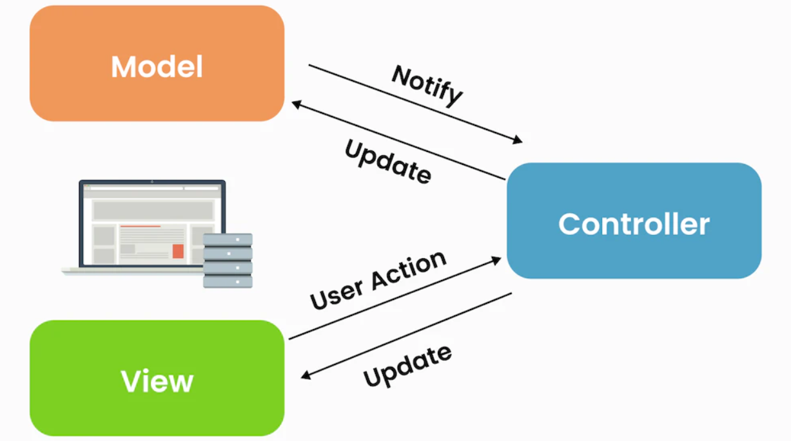
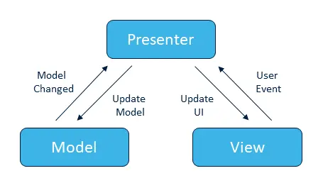

## What is MVC

MVC (Model-View-Controller) is a UI architecture pattern that separates an application into three interconnected components: the Model (handles data), the View (displays the user interface), and the Controller (manages user input and updates the Model and View accordingly).

### MVC

>In MVC, the Controller often has knowledge of the View's implementation details, creating tight coupling
that can lead to poor scalability and testability.

## What is MVP

MVP (Model-View-Presenter) is a design pattern where the Presenter handles the logic and updates the View, while the View remains passive and only displays data, promoting a clearer separation of concerns.

### MVP

>In MVP, The Presenter is aware of the existence of View, but does not contain the knowledge of the
View's implementation details, createing ligter coupling.

## What is MVVM

MVVM(Model-View-ViewModel) is a UI architecture pattern that seperates presentation logic and business logic from the user interface.

### MVVM

>From the diagram above, ViewModel is unaware of the existence of View and so does Model is unaware of
the existence of ViewModel. This architecture prevents frequent UI changes that causes subsequent
changes to ViewModel and Model, where business logic and data are stored.

### `Reversed MVVM (My idea)`

>`My Idea`: If the application needs frequent updates to its business logic but the UI remains relatively consistent, this architecture could be an ideal solution.

---

## MVC vs MVP vs MVVM Comparison

| Feature                  | MVC                                    | MVP                                   | MVVM                                |
|--------------------------|----------------------------------------|---------------------------------------|-------------------------------------|
| **Core Components**      | Model, View, Controller                | Model, View, Presenter                | Model, View, ViewModel              |
| **UI Update Approach**   | Controller updates View                | Presenter updates View directly       | View bound to ViewModel properties  |
| **Primary Responsibility** | Controller: Process input and update Model/View | Presenter: Handle UI logic           | ViewModel: Expose data and commands |
| **View’s Role**          | Displays UI and accepts input          | Passive, no logic                     | Declarative, bound to ViewModel     |
| **Testability**          | Limited (Controller tightly coupled)   | Good (Presenter can be tested)        | Excellent (ViewModel fully testable) |
| **Complexity Management** | Controller may become overloaded      | Presenter can become “God Object”     | Managed through data binding        |
| **Data Binding Support** | None (manual View updates)             | None (manual View updates)            | Yes (automatic View updates)        |
| **Common Use Cases**     | Web applications, simple UIs           | Mobile apps, desktop applications     | Data-driven UIs, complex interactions |
| **UI Responsiveness**    | Low (manual updates needed)            | Medium (Presenter handles it)         | High (two-way data binding)         |
| **View-Logic Coupling**  | High (Controller interacts with View)  | Medium (Presenter interacts with View)| Low (ViewModel decoupled from View) |

## Summary

The evolution of MVVM from MVP and MVC reduces the dependency between the UI and the rest of the application, enabling better scalability.


